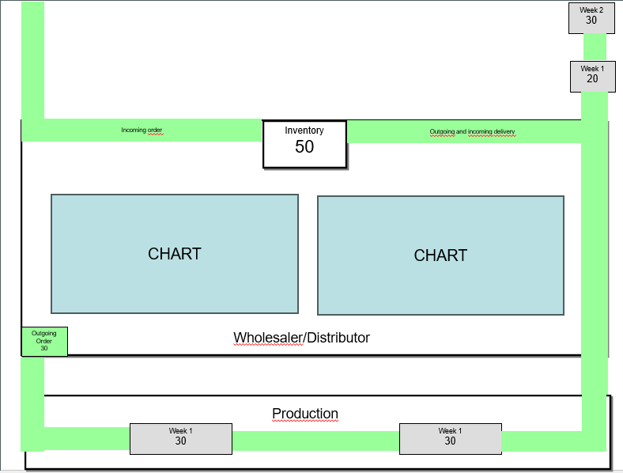

## Case Title
Beer Game: Interactive Supply Chain Management Simulation Platform

## Background
The Beer Game is a renowned educational simulation developed at MIT Sloan School of Management in the 1960s by Jay Forrester to teach supply chain management principles. Despite being over 60 years old, it remains one of the most effective tools for demonstrating the bullwhip effect, inventory management challenges, and the importance of information sharing in supply chains. Currently, most digital implementations are either proprietary, expensive for educational institutions, or lack modern features like AI-assisted learning and comprehensive analytics. There is a need for an accessible, feature-rich web platform that can serve both individual learners and educational institutions while leveraging modern AI capabilities to enhance the learning experience.

## Purpose
This application aims to create a comprehensive, AI-enhanced web-based Beer Game platform that serves two primary purposes: (1) providing an engaging single-player and multiplayer simulation experience for individuals to learn supply chain management concepts through hands-on practice, and (2) offering educators a complete classroom management system with automated student allocation, progress tracking, AI-generated assessments, and detailed analytics. The application will make supply chain education more accessible, interactive, and measurable while demonstrating how AI can enhance both learning outcomes and teaching efficiency.

## Target Users

The platform serves four distinct user tiers, each with specific needs and access levels:

**Tier 0: Free Registered Users**
- Individual learners exploring Beer Game for the first time
- Students curious about supply chain concepts
- Purpose: Demo, testing, and understanding core game mechanics
- Access: Basic single-player game with fixed parameters

**Tier 1: Paid Students ($5/month)**
- Supply chain professionals seeking skill development and training
- Individual learners wanting full-featured learning experience
- Self-studying students preparing for supply chain careers
- Purpose: Deep learning through configurable games and AI-powered assessments
- Access: Full game configuration, AI assessments, personal progress tracking

**Tier 2: Paid Instructors ($29.99/month)**
- Educators teaching operations or supply chain management courses
- Corporate training coordinators managing learning programs
- Researchers studying supply chain behavior and decision-making patterns
- Purpose: Classroom management, automated grading, and longitudinal analytics
- Access: All Paid Student features + class management tools + organization branding

**Tier 3: Class Students (via $5 one-time seat purchase)**
- Students enrolled in formal courses by instructors
- Corporate trainees in structured learning programs
- Purpose: Structured learning with instructor oversight and grading
- Access: Class-assigned multiplayer games, AI assessments, instructor feedback

## Core Functionality

### Must Have (MVP)

The platform provides tier-based functionality, with each tier building upon the previous one.

---

#### **Tier 0: Free Registered Users**

**Registration & Authentication:**
- Email-based registration (required for anti-abuse and rate limiting)
- Email verification before first game
- Password-based authentication via Supabase Auth

**Game Access:**
- Single-player game mode only
- Fixed role selection (Retailer, Wholesaler, Distributor, or Factory)
- AI-controlled opponents using low-cost AI models (Gemini Flash)
- Fixed game parameters:
  - Duration: 20 weeks (non-configurable)
  - Standard cost parameters
  - Standard lead times
  - Standard difficulty level

**Game Dashboard:**
- Interactive real-time game dashboard displaying:
  - Current inventory levels and backorders
  - Incoming orders and shipments in transit
  - Week/round indicator (fixed 20 weeks)
  - Real-time cost accumulation
  - Order placement interface with validation
- Basic data visualization showing:
  - Inventory levels over time
  - Orders placed and received
  - Cost trends

**Game Completion:**
- Basic performance summary (total cost, final inventory)
- No AI-generated assessment or detailed feedback
- No game state persistence (session-only)

**Rate Limiting:**
- Maximum 3 games per day
- 1 concurrent game at a time
- CAPTCHA protection on registration

---

#### **Tier 1: Paid Student ($5/month subscription)**

**Includes all Free Tier features, plus:**

**Enhanced Game Access:**
- Single-player mode with full configuration options:
  - Duration (20-52 weeks)
  - Cost parameters (inventory holding cost, backorder cost, transport costs, lost sales costs)
  - Lead times (order delay, shipping delay)
  - Difficulty level (affects demand variability)
  - Communication/visibility levels (no visibility, one level, two levels, three levels)
- AI-controlled opponents using high-ability AI models (Gemini Pro, GPT-4)
- Unlimited games (no daily limit)
- Game state persistence (save/resume games)

**AI-Generated Assessments:**
- Automatically generated assessment after game completion
- Questions tailored to specific events in the student's game
- Question formats:
  - Multiple choice (AI-generated, auto-graded)
  - Short text answer (AI-assessed with feedback)
  - Long text answer (AI-assessed with detailed feedback)
  - Numeric answer (auto-graded)
- Weighted scoring based on question difficulty
- Instant AI-powered feedback on answers

**Enhanced Visualizations:**
- Game completion summary with AI insights:
  - Performance metrics and total cost breakdown
  - Comparison with optimal performance benchmarks
  - Key insights about decision patterns and their impacts
  - Educational content explaining supply chain phenomena
  - Bullwhip effect visualization and analysis

**Personal Progress Tracking:**
- Game history across all played games
- Performance trends over time
- Ability to review past games and decisions

---

#### **Tier 2: Paid Instructor ($29.99/month subscription)**

**Includes all Paid Student features, plus:**

**Class Management:**
- Create and manage unlimited classes
- Bulk student enrollment:
  - CSV import with automatic email invitations
  - Manual entry with individual email invitations
- Automated game allocation (1-4 students per game), with manual override capability
- Purchase class seats to enroll students ($5 per seat, one-time)

**Seat Management:**
- Buy seats with bulk pricing:
  - 1-25 students: $5.00/student
  - 26-100 students: $4.50/student (10% discount)
  - 101-250 students: $4.00/student (20% discount)
  - 251+ students: $3.50/student (30% discount)
- Seats are non-reusable (preserve student data for longitudinal analytics)
- Seat allocation across multiple classes

**Common Game Configuration:**
- Set identical game parameters for all students in a class:
  - Duration, cost parameters, lead times, difficulty level, external demand pattern
- Ensures fair comparison of student performance across games
- Students cannot modify instructor-set configurations

**Real-Time Monitoring:**
- View all active game sessions for each class
- Track student progress and completion status in table view
- Monitor individual student performance metrics in real-time
- Class-wide controls:
  - Pause all games simultaneously
  - Resume all games
  - Reset all games to week 1 (with confirmation)
- Individual game actions:
  - Remove student from game (replaced by AI player)
  - View detailed week-by-week game progress
  - Access student decision history

**AI-Generated Assessment System:**
- Automatically generate custom assessments for each student based on their gameplay
- Questions tailored to specific supply chain concepts demonstrated during gameplay
- Multiple question types with AI-powered grading:
  - Multiple choice (AI-generated options, auto-graded)
  - Short text (AI-assessed with feedback)
  - Long text (AI-assessed with detailed feedback)
  - Numeric answers (auto-graded)
- AI assigns weights to each question based on difficulty
- Set minimum passing score threshold (e.g., 70%)
- Students can resubmit improved answers (configurable limit per question)
- Instructor can review and override AI grading if needed

**Communication System:**
- Broadcast messages to all students in a class
- Direct messages to individual students
- In-app notifications + email delivery via SendGrid

**Analytics Dashboard:**
- Class-wide performance metrics and comparisons
- Individual student progress reports
- Bullwhip effect analysis across all games in class
- Comparative performance tracking over time (across semesters/years)
- Longitudinal analytics enabled by non-reusable seats
- Exportable reports (PDF, CSV)
- Performance rankings by student, by role, by game session

**Organization Branding (White-Label):**
- Upload custom organization logo
- Set custom theme colors (primary, secondary, accent)
- Branded UI visible to instructor and their students
- Enhances institutional identity and professionalism

**Completion Status Management:**
- Toggle student approval status (approved/not approved)
- Based on assessment passing threshold
- Track which students have completed requirements

---

#### **Tier 3: Class Seat (One-time $5 purchase per student)**

**Access via Instructor Enrollment Only:**
- Students cannot self-register for class seats
- Instructors purchase seats and assign to student emails
- Student receives email invitation to join class

**Class Student Access:**
- Play only games assigned by instructor in the class
- Cannot configure game parameters (instructor sets all configurations)
- Cannot create own independent games
- Access to multiplayer games with other students in same class
- AI opponents use high-ability models (Gemini Pro, GPT-4)

**Multiplayer Game Features:**
- Turn-based gameplay with other students
- Real-time status indicators (who has submitted orders)
- In-game chat (if enabled by instructor)
- Player presence indicators
- Automatic AI takeover if player inactive for 2 minutes

**AI-Generated Assessments:**
- Receive assessments tailored to class game performance
- All question types with AI-powered grading
- See pass/fail status based on instructor's threshold
- Receive instructor feedback and grading decisions

**Progress Tracking:**
- View history of all class-assigned games
- See performance metrics for each game
- Track completion status and approval status
- Access to game replays and decision history

**Data Persistence:**
- Game history preserved permanently in instructor's analytics
- Enables longitudinal comparison across semesters/years
- Student data tied to seat purchase (non-transferable)

---

### Dual Role Support

**Important Feature:** Users can have multiple roles simultaneously:
- A Paid Student subscriber can also be enrolled as a Class Student (via instructor's seat purchase)
- Data separation: Personal games vs. class-assigned games
- Instructor can also play games as a "student" by purchasing a seat for themselves (useful for testing configurations)

### Nice to Have (Optional Extensions)

**Enhanced Communication:**
- Advanced in-game chat features:
  - Channel-based chat (role-specific, game-wide)
  - @mentions and notifications
  - File attachments and image sharing
- Voice/video chat integration for instructor-led sessions
- Discussion forums tied to specific games or classes

**Advanced Game Customization:**
- Variable demand patterns:
  - Seasonal variations (e.g., holiday spikes)
  - Trend-based demand (growing/declining markets)
  - Random shocks and disruptions
- Different product types beyond beer (electronics, fashion, food)
- Custom supply chain configurations:
  - 3-tier (simplified)
  - 5-tier (extended with raw material supplier)
  - Multi-product supply chains
- Industry-specific scenarios (automotive, retail, pharmaceuticals)

**Gamification Features:**
- Global leaderboards:
  - Top performers by cost
  - Top performers by role
  - Monthly tournaments
- Achievement badges and trophies:
  - "Zero Stockout Master"
  - "Bullwhip Minimizer"
  - "Cost Optimizer"
- Performance levels and progression system
- Challenges and time-limited events

**Advanced Analytics & AI:**
- Predictive performance indicators:
  - AI predicts likely outcome mid-game
  - Early warning system for poor decisions
- Decision pattern analysis:
  - Identify ordering biases (over-ordering, under-ordering)
  - Compare decision style to successful players
- Comparative benchmarking:
  - Historical data across thousands of games
  - Industry best practices
- AI Instructor Assistant:
  - Suggests interventions for struggling students
  - Recommends personalized learning content
  - Identifies common class-wide mistakes

**Enterprise Features:**
- Enterprise tier ($299/month):
  - Unlimited class seats
  - SSO integration (SAML, OAuth)
  - Custom domain (beergame.university.edu)
  - Priority support + dedicated account manager
- Integration with Learning Management Systems:
  - Canvas, Moodle, Blackboard
  - Grade passback (LTI integration)
  - Single sign-on via LMS
  - Deep linking to assignments
- Department seat pooling:
  - University buys seat pool
  - Multiple instructors draw from shared pool
  - Department admin dashboard

**Mobile & Accessibility:**
- Native mobile apps (iOS/Android)
- Progressive Web App (PWA) for offline play
- Responsive design optimized for mobile gameplay
- Accessibility features (WCAG 2.1 AA compliance):
  - Screen reader support
  - Keyboard navigation
  - High contrast mode
  - Adjustable font sizes

**Social & Community:**
- Social sharing features:
  - Share game results on LinkedIn, Twitter
  - "Challenge a friend" invitations
- Marketplace for instructor-created scenarios:
  - Instructors share custom configurations
  - Revenue split (70% instructor, 30% platform)
- Community forums and discussion boards
- Best practices library and teaching resources

**Advanced Replay & Analysis:**
- Detailed game replay with step-by-step visualization
- Strategy analysis tools:
  - "What-if" simulator (replay with different decisions)
  - Compare multiple students' strategies side-by-side
- Downloadable game data for external analysis
- Integration with data science tools (Python, R, Excel)

**Collaborative Features:**
- Team mode:
  - Multiple students manage one supply chain position
  - Role assignment within teams (planner, executor, analyzer)
  - Team communication and decision voting
- Peer review system:
  - Students review each other's strategies
  - Instructor facilitates peer feedback
- Collaborative learning assignments:
  - Group projects across multiple games
  - Joint analysis and reporting

**Certification & Credentials:**
- Official "Beer Game Mastery Certificate":
  - Recognized by supply chain industry
  - Partner with APICS, CSCMP
  - Rigorous assessment required
  - Students pay $49 for certification exam
- Digital badges and credentials for LinkedIn

**Localization:**
- Multilingual support:
  - English, Spanish, French, German, Chinese, Japanese
  - Localized UI and content
  - Regional supply chain scenarios
- Currency localization for pricing
- Regional compliance (GDPR, CCPA, etc.)

**Experimental Features:**
- VR/AR Beer Game experience:
  - Immersive 3D warehouse visualization
  - Walk through supply chain physically
  - Premium add-on ($9.99/month)
- Live tournament mode:
  - Monthly global tournaments
  - Prizes for top performers
  - Sponsored by supply chain companies (recruiting pipeline)
- Corporate training tier ($999/month):
  - Custom scenarios based on company's actual supply chain
  - Integration with company's ERP data
  - Executive dashboards for L&D teams

## Data Requirements

**User Management:**
- Users: Managed by Supabase Auth (auth.users table) with user_id (UUID), email, encrypted_password
- User Profiles: user_id (FK to auth.users), user_type (student/instructor/individual), full_name, institution, created_at, last_login, metadata (JSONB)
- Instructors: instructor_id, user_id (FK to auth.users), subscription_status, subscription_plan, subscription_expiry, stripe_customer_id, institution_name

**Game Data:**
- Games: game_id, game_type (single/multiplayer), creator_id, created_at, duration_weeks, status (active/completed/abandoned), difficulty_level
- Game Sessions: session_id, game_id, start_time, end_time, config_parameters (JSON: costs, delays, starting_inventory)
- Players: player_id, session_id, user_id (nullable for AI), role (retailer/wholesaler/distributor/factory), is_ai_controlled

**Game State (per week/round):**
- Game Rounds: round_id, session_id, week_number, timestamp
- Player States: state_id, round_id, player_id, inventory_level, backorder_count, incoming_shipment, incoming_order, order_placed, inventory_cost, backorder_cost, cumulative_cost

**Education System:**
- Classes: class_id, instructor_id, class_name, academic_year, created_at, active_status
- Class Students: enrollment_id, class_id, user_id, enrollment_date, status
- Class Games: class_game_id, class_id, game_id, assigned_students (array), status, completion_required
- Assessments: assessment_id, class_game_id, student_id, generated_questions (JSON), answers (JSON), score, feedback (AI-generated), submitted_at
- Questions: question_id, game_session_id, question_text, options (JSON array), correct_answer, concept_category, difficulty, generated_by_ai

**Payment and Subscriptions:**
- Subscriptions: subscription_id, instructor_id, plan_type, start_date, end_date, status, payment_status
- Payments: payment_id, subscription_id, amount, currency, payment_date, payment_method, transaction_id, status

**Analytics and Reporting:**
- Performance Metrics: metric_id, session_id, player_id, total_cost, inventory_variance, order_variance, bullwhip_coefficient, decision_quality_score
- Class Analytics: analytics_id, class_id, aggregated_metrics (JSON), generated_at

## User Flows

### Flow 1A: Free User Playing Demo Game

**Entry Point**: New visitor lands on homepage

1. **Landing Page**
   - Visitor views hero section explaining the Beer Game concept
   - Reads "How to Play" section with game rules and supply chain structure
   - Sees two CTA buttons:
     - "Try Free Demo" (no credit card required)
     - "Start Full Experience" ($5/month)
   - Clicks "Try Free Demo" button

2. **Registration (Required)**
   - Redirects to registration page
   - User registers with email and password
   - System shows: "Registration required for rate limiting and anti-abuse"
   - Receives verification email and clicks verification link
   - Redirected back to platform and automatically logged in

3. **Free Demo Game Setup**
   - System shows: "Free Demo - Fixed 20-week game"
   - User selects role (Retailer, Wholesaler, Distributor, or Factory)
   - No configuration options (all parameters fixed)
   - System shows: "Want to customize? Upgrade to Paid Student ($5/month)"
   - Clicks "Start Demo Game" button

4. **Game Dashboard (Week 1-20)**
   - **View State**:
     - Current inventory (12 units starting)
     - Backorders (if any)
     - Incoming orders and shipments in transit
     - Week indicator "Week X of 20" (fixed duration)
     - Real-time cost accumulation (basic)
   - **Make Decision**: User enters order quantity
   - **Submit**: User clicks "Place Order" button
   - **Processing**: System advances to next week
     - AI opponents (low-cost models: Gemini Flash) make decisions
     - System calculates inventory, backorders, costs
   - **Repeat**: User plays all 20 weeks

5. **Game Completion (Free Tier)**
   - After final week, shows basic summary:
     - Total cost
     - Final inventory level
     - Total backorders
   - **No AI-generated insights or detailed analysis**
   - Upgrade prompt:
     - "Want AI-powered assessment and insights? Upgrade to Paid Student ($5/month)"
     - "Unlock full configuration options and save game history"
   - Options:
     - "Play Another Demo Game" (count: X of 3 today)
     - "Upgrade to Paid Student" → subscription page
     - "Exit to Dashboard"

6. **Conversion Touchpoints (During & After Game)**
   - In-game: Greyed-out configuration options with "Paid Student" badges
   - Post-game: Preview of AI assessment questions (locked)
   - Rate limit reminder: "2 more demo games today. Unlimited with Paid Student."

**Exit Point**: User returns to dashboard or logs out

---

### Flow 1B: Paid Student Playing Configured Game

**Entry Point**: Paid Student ($5/month) logs into platform

1. **Dashboard**
   - Sees "Personal Games" section
   - Views game history with saved/completed games
   - Clicks "Start New Game" button

2. **Game Configuration**
   - Selects role (Retailer, Wholesaler, Distributor, or Factory)
   - **Full Configuration Access:**
     - Duration slider (20-52 weeks)
     - Cost parameters:
       - Inventory holding cost per unit per week
       - Backorder cost per unit per week
       - Transport costs, lost sales costs
     - Lead times (order delay, shipping delay)
     - Difficulty level (easy, medium, hard)
     - Visibility level (none, 1-level, 2-level, 3-level)
   - Sees: "Powered by high-ability AI (Gemini Pro)"
   - Clicks "Start Game" button

3. **Game Dashboard (Week 1-N)**
   - Same gameplay as free tier but:
     - Configurable duration (not fixed at 20)
     - High-ability AI opponents (Gemini Pro, GPT-4)
     - Game state auto-saves (can pause/resume)
   - **View State**:
     - Current inventory, backorders
     - Incoming orders and shipments
     - Week indicator (e.g., "Week 5 of 35")
     - Real-time detailed cost breakdown
   - **Make decisions and progress through weeks**

4. **Game Completion (Paid Student)**
   - After final week, AI generates comprehensive summary:
     - **Performance Metrics:**
       - Total costs by category (inventory, backorder, transport, lost sales)
       - Final inventory, total backorders
       - Peak inventory/backorder weeks
     - **AI-Generated Assessment:**
       - 8-12 questions tailored to this specific game
       - Multiple choice, short text, long text, numeric
       - Instant AI feedback on answers
       - Weighted scoring
     - **AI-Generated Insights:**
       - "You over-ordered in weeks 5-8, causing excess inventory..."
       - Decision pattern analysis (reactive vs. proactive)
       - Bullwhip effect contribution analysis
     - **Educational Content:**
       - Explanation of supply chain phenomena
       - Bullwhip visualization
       - Recommended improvement strategies
   - Options:
     - "Play Again" → new configuration
     - "Save to Game History" (automatic)
     - "View All Games" → personal game history
     - "Compare with Past Games" → performance trends

5. **Personal Progress Tracking**
   - View game history across all played games
   - Performance trends over time
   - Review past decisions and outcomes
   - Download game data for external analysis

**Exit Point**: Returns to dashboard with game saved to history

---

---

### Flow 2: Instructor Setting Up Class Game

**Entry Point**: Instructor lands on homepage

1. **Landing Page**
   - Instructor clicks "For Educators" button in navigation
   - Views educator features and pricing information:
     - Instructor subscription: $29.99/month
     - Seat pricing: $5 per student (one-time)
     - Bulk discounts displayed
   - Sees comparison: "One-time $5/student vs. competitors' recurring fees"

2. **Instructor Registration & Subscription**
   - Clicks "Get Started" button
   - Registers with email address (institutional email preferred)
   - Email verification required
   - Redirected to subscription page:
     - **Instructor Plan: $29.99/month**
     - Includes all Paid Student features + classroom tools
     - 14-day free trial (no credit card required for trial)
   - After trial or immediately, redirected to Stripe Checkout
   - Enters payment information ($29.99/month)
   - Returns to platform after payment setup

3. **Instructor Dashboard Access**
   - Lands on instructor dashboard showing:
     - **Seat Balance:** "0 seats available" (new instructor)
     - "Buy Seats" button prominently displayed
     - List of classes (empty for new instructor)
     - "Create New Class" button
     - Navigation to Monitoring, Analytics, Settings, Organization Branding

4. **Purchase Seats**
   - Clicks "Buy Seats" button
   - Seat purchase interface:
     - **Interactive calculator:**
       - Input: Number of students (e.g., 30)
       - Output: Total cost with bulk discount
         - "30 students × $5.00 = $150.00"
         - "26-100 students: $4.50/student (10% off)"
     - Bulk pricing tiers displayed:
       - 1-25: $5.00/student
       - 26-100: $4.50/student (10% discount)
       - 101-250: $4.00/student (20% discount)
       - 251+: $3.50/student (30% discount)
     - Enters desired quantity (e.g., 35 students)
     - System shows: "35 seats × $4.50 = $157.50 (10% bulk discount applied)"
   - Clicks "Purchase Seats" button
   - Redirected to Stripe Checkout for one-time payment
   - Returns to platform after payment
   - **Seat balance updated:** "35 seats available"

5. **Create Class**
   - Clicks "Create New Class" button
   - Enters class information:
     - Class name (e.g., "Supply Chain Management 101 - Fall 2024")
     - Academic year/semester
   - Optional: Upload organization logo and set theme colors (white-label branding)
   - Clicks "Create Class"
   - Redirected to class detail page

6. **Add Students & Allocate Seats**
   - Instructor has two options for adding students:
     - **Option A - Bulk Import:**
       - Clicks "Import Students" button
       - Downloads CSV template (Name, Email columns)
       - Fills in 30 student names and emails
       - Uploads CSV file
       - System validates and shows preview: "30 students ready to enroll"
       - System shows: "This will use 30 of your 35 available seats"
       - Confirms import
     - **Option B - Manual Entry:**
       - Clicks "Add Student" button
       - Enters student name and email
       - System shows: "Seat used: 1 of 35"
       - Repeats for each student
   - System sends email invitations to all students:
     - "You've been enrolled in [Class Name] by [Instructor Name]"
     - Link to register/log in and access class

7. **Configure Game Session (Common Settings for Class)**
   - Clicks "Create Game Assignment" button
   - **Common Configuration Applied to All Games:**
     - Game duration (20-52 weeks) - same for all students
     - Cost parameters (inventory, backorder, transport, lost sales)
     - Lead times (order delay, shipping delay)
     - Difficulty level (affects demand variability)
     - External demand pattern (ensures fair comparison)
     - Communication/visibility level (none, 1-level, 2-level, 3-level)
   - **Rationale:** "Identical settings enable fair performance comparison across students"
   - Sets allocation preferences:
     - Students per game (1-4)
     - Random allocation or manual assignment
   - Clicks "Auto-Allocate Students"
   - System distributes 30 students across game sessions
   - Manual override: Drag-and-drop students to adjust

8. **Review Allocation & Activate**
   - Views allocation summary:
     - 8 game sessions created (30 students / 4 per game = 7.5, rounds to 8)
     - Students assigned with roles (Retailer, Wholesaler, Distributor, Factory)
     - AI-controlled positions highlighted (to fill incomplete games)
     - Configuration summary displayed
   - Can manually adjust if needed
   - Clicks "Activate Games" button
   - Students receive notification:
     - Email: "Your Beer Game assignment is ready!"
     - In-app: Notification badge on dashboard

9. **Monitor Progress (Real-Time)**
   - Navigates to "Monitoring" dashboard
   - Views table of all active games:
     - Game ID, status, current week
     - Student names, roles, real-time costs
     - Completion status (in progress, completed, approved)
   - **Class-wide controls:**
     - "Pause All" - freezes all games
     - "Resume All" - restarts paused games
     - "Reset All" - resets to week 1 (with confirmation)
   - **Individual game actions:**
     - Click game to see detailed view (week-by-week progress, decisions)
     - "Remove Student" → replaced by AI, student data archived
   - Toggle student approval status (based on assessment results)

9. **Send Messages to Students**
   - From monitoring dashboard, instructor clicks "Messages" button
   - Two options:
     - **Broadcast to All Students:**
       - Clicks "Message All Students" button
       - Composes message in text editor
       - Optional: Attach files (PDFs, instructions)
       - Clicks "Send to All" button
       - All students in class receive email + in-app notification
     - **Message Individual Student:**
       - Clicks message icon next to specific student
       - Composes personalized message
       - Clicks "Send" button
       - Student receives email + in-app notification

10. **Generate Assessments (Multiple Question Types)**
    - After students complete games, instructor clicks "Generate Assessments"
    - System uses AI to create custom assessment for each student:
      - Questions based on specific events in that student's game session
      - Covers concepts like bullwhip effect, inventory management, ordering strategies
    - **Question types generated:**
      - **Multiple choice:** 4 options, AI-generated, auto-graded
      - **Short text answer:** Brief explanation required, AI-assessed
      - **Long text answer:** Detailed analysis required, AI-assessed
      - **Numeric answer:** Calculation-based, auto-graded
    - **AI assigns weights** to each question based on difficulty
    - **Instructor sets passing threshold:**
      - Enters minimum score percentage (e.g., 70%)
      - Students must meet threshold to be marked as "approved"
    - Instructor reviews and can edit generated questions
    - Instructor clicks "Approve and Send Assessments"
    - Students receive assessment notification

11. **View Analytics**
    - Instructor navigates to "Analytics" dashboard
    - Views class-wide metrics:
      - Average total costs by game session (comparable since all use same settings)
      - Bullwhip effect analysis across all games
      - Common decision patterns and mistakes
      - Individual student performance rankings
      - Distribution of costs by type (inventory, backorder, transport, lost sales)
    - **Comparative analysis enabled by common configuration:**
      - Fair comparison of student performance
      - Identification of best-performing students
      - Analysis of role-specific challenges
    - Applies filters (by game session, by role, by time period)
    - Clicks "Export Report" button
    - Selects format (PDF for presentation, CSV for further analysis)
    - Downloads comprehensive class report

**Exit Point**: Instructor logs out or navigates to other classes

---

### Flow 3: Student Completing Assessment (Multiple Question Types)

**Entry Point**: Student receives email notification about assessment

1. **Email Notification**
   - Student receives email: "Your Beer Game assessment is ready"
   - Clicks link in email
   - Redirected to login page (if not logged in)

2. **Assessment Dashboard**
   - Student lands on assessment page showing:
     - Game summary (their role, total cost, final week)
     - Number of questions (typically 8-12 questions of mixed types)
     - Weighted scoring explanation: "Questions are weighted by difficulty"
     - Passing threshold displayed (e.g., "You need 70% to pass")
     - Time estimate (20-30 minutes)
   - Clicks "Start Assessment" button

3. **Answer Questions (Multiple Types)**
   - **For Multiple Choice Questions:**
     - Student reads question (e.g., "In week 8, you placed an order for 20 units despite having 15 units in inventory. What likely caused your backlog in week 12?")
     - Views 4 multiple-choice options (A, B, C, D)
     - Selects one answer by clicking radio button
     - Question weight displayed (e.g., "Weight: 1.5x")
     - Clicks "Next Question"

   - **For Short Text Answer Questions:**
     - Student reads question (e.g., "Briefly explain why your inventory peaked in week 12.")
     - Text input field with character limit (100-200 characters)
     - Placeholder: "Enter your answer in 2-3 sentences"
     - Question weight displayed (e.g., "Weight: 2x")
     - Clicks "Next Question"

   - **For Long Text Answer Questions:**
     - Student reads question (e.g., "Analyze your ordering strategy throughout the game. How did your decisions contribute to or mitigate the bullwhip effect?")
     - Large text area with character limit (300-500 characters)
     - Placeholder: "Provide a detailed analysis with specific examples from your game"
     - Question weight displayed (e.g., "Weight: 3x")
     - Clicks "Next Question"

   - **For Numeric Answer Questions:**
     - Student reads question (e.g., "Calculate the total inventory holding cost you incurred in weeks 5-10.")
     - Number input field
     - Units displayed (e.g., "dollars")
     - Question weight displayed (e.g., "Weight: 1x")
     - Clicks "Next Question"

   - Progress indicator shows questions completed (e.g., "Question 5 of 10")
   - Can navigate back to previous questions before final submission

4. **Submit Assessment**
   - After final question, student clicks "Submit Assessment"
   - Confirmation modal: "Are you sure you want to submit? You cannot change answers after submission."
   - Student confirms submission
   - System processes:
     - Auto-grades multiple choice and numeric questions
     - Sends text answers to AI for assessment
     - Calculates weighted score

5. **Immediate Feedback (AI-Generated)**
   - System shows results page:
     - **Overall weighted score** (e.g., "78.5% - PASSED" in green or "65.0% - NOT PASSED" in red)
     - Passing threshold reminder (e.g., "Passing threshold: 70%")
     - **Question-by-question breakdown:**
       - Question number and type
       - Question weight
       - Points earned / points possible
       - Student's answer displayed
       - For multiple choice/numeric: Correct answer shown if wrong
       - **AI-generated explanation for each question:**
         - Example for wrong MC: "Your answer was incorrect. The backlog was caused by underestimating the 2-week shipping delay in weeks 6-8. When you finally increased orders in week 8, it was too late to prevent stockouts."
         - Example for text answer: "Your analysis correctly identified the reactive ordering pattern. However, you could have discussed how this contributed to the bullwhip effect in more detail. Score: 7/10"
         - Example for numeric: "Correct! The total inventory holding cost was $450 (90 units × $0.50/unit/week × 10 weeks)."
   - Student can review game data alongside feedback
   - Link to detailed game replay for context

6. **Approval Status Update**
   - If student passed (score ≥ threshold):
     - Status automatically updated to "Approved"
     - Congratulatory message displayed
     - Option to download certificate
   - If student failed (score < threshold):
     - Status remains "Not Approved"
     - Message: "Please review the feedback and discuss with your instructor"
     - Instructor notified of student's score

7. **Download Certificate (If Passed)**
   - Student clicks "Download Certificate" button
   - Receives PDF certificate showing:
     - Game completion
     - Assessment score
     - Date completed
     - Instructor's signature (digital)

**Exit Point**: Student returns to dashboard or logs out

---

### Flow 4: Paid Student Upgrading to Instructor

**Entry Point**: Paid Student ($5/month) wants to become an instructor

1. **Discovery**
   - Paid Student sees "Become an Instructor" CTA in dashboard
   - Or navigates to Account Settings → "Upgrade to Instructor"
   - Clicks "Learn More" button

2. **Upgrade Page**
   - Views instructor benefits:
     - Create unlimited classes
     - Purchase seats to enroll students
     - AI-generated assessments and grading
     - Real-time monitoring and analytics
     - Organization branding
   - Pricing displayed:
     - Current: $5/month (Paid Student)
     - New: $29.99/month (Instructor - includes Paid Student features)
     - Effective cost: +$24.99/month
   - 14-day free trial offered
   - Clicks "Upgrade to Instructor" button

3. **Payment Update**
   - Redirected to Stripe Checkout
   - Sees prorated billing:
     - Current period credit applied
     - New subscription: $29.99/month starting [date]
   - Confirms upgrade
   - Returns to platform

4. **Instructor Dashboard Unlocked**
   - Dashboard now shows instructor features:
     - "Buy Seats" button
     - "Create Class" button
     - Organization Branding settings
     - Analytics navigation
   - Tooltip: "Welcome to Instructor mode! Buy seats to start enrolling students."
   - Still has access to personal Paid Student features (can play own games)

5. **First Class Setup**
   - Follows Flow 2 steps 4-9 to purchase seats and create first class

**Exit Point**: Instructor manages classes while also using personal game features

**Note:** This flow demonstrates the dual-role capability - instructor subscription includes all Paid Student features plus classroom tools.

---

### Flow 5: Instructor Managing Seats and Subscription

**Entry Point**: Instructor logged into dashboard

1. **Access Billing Dashboard**
   - Instructor clicks profile icon in top-right
   - Selects "Billing & Seats" from dropdown menu
   - Lands on billing management page

2. **View Current Status**
   - Page displays two sections:

   **Subscription Status:**
   - Current plan: "Instructor - $29.99/month"
   - Status: Active
   - Next billing date: [Date]
   - Payment method: **** **** **** 1234

   **Seat Inventory:**
   - Available seats: 5
   - Total purchased: 35
   - Seats in use: 30 (across 2 classes)
   - Visual breakdown by class:
     - "Supply Chain 101": 18 students
     - "Operations Management": 12 students

3. **Purchase Additional Seats**
   - Instructor needs to add 15 more students for new class
   - Clicks "Buy More Seats" button
   - Interactive calculator appears:
     - Input: 15 students
     - Current total: 35 + 15 = 50 students
     - Pricing tier: 26-100 students = $4.50/seat (10% discount)
     - Total cost: 15 × $4.50 = $67.50
   - Shows comparison: "Competitor recurring: 15 × $10/semester = $150/semester"
   - Clicks "Purchase 15 Seats"
   - Redirected to Stripe Checkout for one-time payment
   - Returns to platform
   - **Seat balance updated:** "Available: 20 seats"

4. **View Seat Usage History**
   - Instructor clicks "Seat History" tab
   - Views table of all seat transactions:
     - Date, Quantity, Price per seat, Total cost, Transaction ID
     - Example:
       - 2024-09-01: 35 seats × $4.50 = $157.50
       - 2024-10-15: 15 seats × $4.50 = $67.50
   - Can download transaction history as CSV
   - Useful for departmental expense tracking

5. **Update Payment Method**
   - Instructor clicks "Update Payment Method"
   - Redirected to Stripe Customer Portal
   - Two payment methods managed:
     - Monthly subscription ($29.99/month)
     - One-time seat purchases (uses same card by default)
   - Updates card information
   - Returns to platform
   - Confirmation message displayed

6. **View Invoices**
   - Instructor clicks "Invoice History" tab
   - Views list of all payments:
     - Monthly subscription invoices ($29.99 recurring)
     - Seat purchase receipts (one-time)
   - Can download any invoice as PDF
   - Filters: "Show all" / "Subscriptions only" / "Seat purchases only"

7. **Cancel Subscription (Edge Case)**
   - Instructor clicks "Cancel Subscription" link (bottom of page)
   - System shows warning:
     - "Students will lose access to class games at end of billing period"
     - "Purchased seats are non-refundable but data will be preserved"
     - "You can still access class data in read-only mode"
   - Instructor confirms cancellation
   - Account remains active until billing period ends
   - Receives confirmation email:
     - Final access date
     - Data archival policy
     - Reactivation instructions (if needed later)

8. **Seat Management - View Student Allocations**
   - Instructor clicks "Manage Seats" button
   - Views detailed seat allocation:
     - Table showing: Student name, Email, Class, Game status, Enrollment date
     - Filter by class or status
     - Search by student name
   - Can see which students are using which seats
   - Reminder: "Seats are non-reusable - removing a student does not free the seat"

**Exit Point**: Instructor returns to main dashboard

---

### Flow 6: Class Student Playing Assigned Multiplayer Game

**Entry Point**: Class Student (Tier 3) receives notification about instructor-assigned game

1. **Game Assignment Notification**
   - Student receives email: "Your Beer Game assignment is ready!"
   - In-app notification badge appears on dashboard
   - Email includes:
     - Class name
     - Instructor name
     - Game configuration summary (duration, difficulty, parameters)
     - Assigned role (Retailer, Wholesaler, Distributor, or Factory)
     - Assigned teammates' names (if visible per instructor settings)

2. **Dashboard Access**
   - Student logs into platform
   - Sees "Class Games" section in dashboard (separate from personal games)
   - Assigned game displays with status badge:
     - "Ready to Start" - waiting for all assigned students to join
     - "In Progress" - game has started
     - "Waiting for You" - other students are waiting
   - Clicks "Enter Game" button

3. **Game Overview (Pre-Start)**
   - Student sees instructor-configured game details (all read-only):
     - Game duration (e.g., "35 weeks")
     - Cost parameters, lead times, difficulty level
     - Communication/visibility settings
     - **Assigned role** (cannot be changed)
     - **Assigned teammates** with their roles
   - Banner shows: "Game configured by [Instructor Name] for [Class Name]"
   - Notice: "You cannot modify game settings. All students play with identical parameters."
   - Clicks "Ready to Play" button

4. **Waiting for Classmates**
   - Shows supply chain diagram with all 4 positions:
     - Retailer: [Student Name] ✓ Ready
     - Wholesaler: [Student Name] - Waiting...
     - Distributor: [Student Name] ✓ Ready
     - Factory: AI Player (if position not filled)
   - Real-time updates as assigned classmates click "Ready to Play"
   - Chat window (if enabled by instructor):
     - Pre-game chat with assigned teammates
     - Can discuss strategy before game starts
   - "Not Ready" / "Ready" toggle button
   - Cannot leave game (penalty: AI takes over, instructor notified)

5. **Game Start Trigger**
   - **Automatic start when:**
     - All assigned students mark themselves "Ready"
     - OR instructor manually starts the game from monitoring dashboard
     - OR 5-minute timeout (AI fills positions of absent students)
   - Countdown notification: "Game starting in 10... 9... 8..."
   - All students receive simultaneous start

6. **Multiplayer Game Dashboard (Week 1-N)**
   - **Turn-based gameplay:**
     - All players see "Week X of [N] - Waiting for all players to submit orders"
     - Each student's own order input is active
     - Other players' order inputs show "Waiting..." status
     - Real-time indicator shows who has submitted (e.g., "3/4 players submitted")
   - **View State** (same as single-player):
     - Current inventory
     - Backorders
     - Incoming orders
     - Incoming shipments
     - Cost accumulation
   - **Visibility based on instructor's configuration:**
     - If visibility enabled: Can see other players' inventory levels in real-time
     - If not: Only see own position
   - **Player presence indicators:**
     - Green dot next to active players
     - Gray dot if player disconnected (AI takes over temporarily)
     - Instructor can see all players' status in monitoring dashboard
   - **Make Decision:**
     - Student enters order quantity
     - Clicks "Submit Order"
     - Status changes to "Waiting for other players..."
   - **Week Advancement:**
     - Once all 4 players submit orders, week auto-advances
     - If player inactive for 2 minutes, AI makes decision for them (warning shown)
     - Instructor receives notification if AI takes over
   - **In-game features (if enabled by instructor):**
     - Chat window with assigned teammates
     - Quick chat messages: Predefined messages like "Order spike incoming!"
     - Can see teammates' names and roles
   - **Instructor controls (from monitoring dashboard):**
     - Can pause game for all students
     - Can remove inactive student (AI takes over permanently)
     - Can view real-time game progress

7. **Game Completion (Multiplayer)**
   - After final week, all students see summary dashboard simultaneously
   - **Performance Comparison (Class Context):**
     - Side-by-side costs for all 4 students in this game
     - Individual rankings within this game (1st, 2nd, 3rd, 4th place)
     - Total supply chain cost (sum of all 4 students)
     - Class-wide ranking (if instructor configured multiple games)
   - **AI-Generated Insights** (personalized for each student):
     - Individual analysis of decisions
     - How student's decisions impacted teammates
     - Contribution to or mitigation of bullwhip effect
     - Comparison to class average performance
   - **Supply Chain Performance:**
     - Bullwhip effect visualization showing all 4 positions
     - Analysis of team coordination (or lack thereof)
     - Educational content explaining supply chain dynamics observed
   - **Download Options:**
     - Download individual game report (PDF)
     - Download game data (CSV) for further analysis

8. **Transition to Assessment**
   - After viewing game summary, student sees notification:
     - "Your instructor has prepared an assessment based on this game"
     - "You must complete the assessment to receive credit"
   - Clicks "Start Assessment" button
   - Proceeds to Flow 3 (Student Completing Assessment)
   - Assessment questions are tailored to this specific multiplayer game session
   - Student's approval status depends on passing the assessment

**Exit Point**: Student completes assessment (Flow 3) and returns to class dashboard

**Note**: This flow is ONLY available to Tier 3 (Class Students) whose instructors have purchased seats. Tier 0 (Free) and Tier 1 (Paid Student) users play single-player games with AI opponents only.

---

## Pages description

### Game dashboard

The game dashboard is the most important page of the website. It comprises everything a player sees when playing the game.

- The game dashboard depends:
  - on the role of the player (Retailer, Wholesaler, Distributor, Factory).
  - on the configuration of the game.
  - The following description assumes the DEFAULT configuration.
  - There must be adaptions for the other configurations.

#### Needed components in the dashboard

- A game board component
  - The inventory facility
  - The production facility (only for the factory)
  - All the main operating values:
    - Current inventory (both positive and negative, where positive is green and negative is red, negative means backorders)
    - Incoming orders (week 1 and week 2)
    - Outgoing order (the only decision point)
    - Production order week 1 and week 2 (only for the factory)
    - Incoming delivery (week 1 and week 2)
    - Outgoing delivery (week 1 and week 2)
- A chat component
  - A chat window with a number of selectable channels where a player can send messages to other players or groups of players.
- Charting components
  - During the game: charts showing the development of the key metrics over time for the current role. Consider this to be part of the game board component, depending on the screen size.
  - After the game: charts showing the development of the key metrics over time for all roles. This must be part of the debriefing component.
- Statistics component
  - Statistics showing the development of the key metrics over time.
  - Typical descriptive statistics (mean, median, standard deviation, etc.)
- Data table component
  - All the game data saved in a table.
- Game state component
  - Metadata about the game state, for instance, the current week, the number of human and AI players, the total number of weeks, waiting for players to submit orders, paused game etc. A player can also choose to leave the game, on which the AI takes over the role of the player.
- Metrics component
  - A number of Key Performance Indicators (KPIs) for the current role.
- Results component
  - A results component visible only after the final week, where the player can see the game report and reflect over the game. 
- Exercises component
  - An exercises component visible only after the final week, where the player can see the exercises and reflect over the game. 

#### Game board component
- The main component of the dashboard shows a layout similar to the original physical beer game board.

##### Inventory facility common for all roles
  - A large rectangular slot in the center of the screen representing the physical inventory facility. Like a warehouse or a factory etc. seen from above.
  - All titles and values are centered, where title is at the top and value is below it. The titles are always shown, while the values are updated in real-time. The exact timing of when the values are updated is explained in the Animation component.
  - Inside each facility, there are four smaller slots in each corner:
    - North east corner: title="Incoming delivery", value="number", 
    - North west corner: title="Outgoing order", value="number", 
    - South west corner: title="Incoming order", value="number", 
    - South east corner: title="Outgoing delivery", value="number" 
  - Notice the idea is the the flow of goods goes top down while the flow of orders goes bottom up. Likewise, shipments flow east while orders flow west. The reason for this layout is to be able to nicely adapt to mobile screens.
  - In the middle of the slot there is a rectangle that shows the current inventory level. The text "Inventory" is always visible aligned to the top and centered; the inventory level is a number under the title, centered, and updated in real-time. The timing of when the values are updated is explained in the Animation component. The inventory can be both positive and negative. If the inventory is negative, it is shown in red and represents backorders, i.e. earlier orders that have not been fulfilled yet. If the inventory is positive, it is shown in green and represents available inventory.
  - Notice that the OUTGOING ORDER is the ONLY value that can be changed by the player. The other values are updated automatically based on the game rules and the timing of when the values are updated is explained in the Animation component.

##### Specifics for the factory (Factory): 
  - Above the inventory facility there is another rectangular slot, representing the production facility. 
  - Inside the production facility, there are TWO slots connected by a thick arrow. The first slot has title "Week 1" with value underneath, the second slot has title "Week 2" with the value underneath. These weeks represent the production lead time.
  - The rectangular has the same width as the inventory facility, and the week slots are placed to the west and east with same width as the smaller slots inside the inventory facility. The week slots fill the vertical space of the production facility.
  - There is a thick arrow that points from the outgoing order slot into week 1 slot in the factory. There is another thick arrow that points from the week 2 into the incoming delivery slot in the inventory facility. 
  - There are two similar slots vertically aligned underneath the outgoing delivery slot with Week 1 and Week 2 titles, representing the transportation lead time.There are thick arrow from the outgoing delivery slot into week 1 slot in the factory and from the week 2 into the incoming delivery slot in the inventory facility.
  - There is a thick arrow pointing into the incoming order slot in the inventory facility.This arrow has the same height as the total of the two Week slots plus the two outgoing arrows.

  
  
Factory Facility in desktop and laptop view

##### Specifics for wholesaler and the distributor:
  - The wholesaler and the distributor have the exact same layout.
  - There are two similar slots vertically aligned above the incoming delivery slot with Week 1 and Week 2 titles, representing the transportation lead time.There are thick arrow from week 1 to week 2 and from week 2 into the incoming delivery slot.
  - There is a thick arrow pointing out from the outgoing order slot in the inventory facility.This arrow has the same height as the total of the two Week slots plus the two outgoing arrows described above.
  - There are two similar slots vertically aligned underneath the outgoing delivery slot with Week 1 and Week 2 titles, representing the transportation lead time.There are thick arrow from the outgoing delivery slot into week 1 slot in the factory and from the week 2 into the incoming delivery slot in the inventory facility.
  - There is a thick arrow pointing into the incoming order slot in the inventory facility.This arrow has the same height as the total of the two Week slots plus the two outgoing arrows.

  
  
Layout for wholesaler and distributor  in desktop and laptop view

##### Specifics for the retailer: 
   - There are two similar slots vertically aligned above the incoming delivery slot with Week 1 and Week 2 titles, representing the transportation lead time.There are thick arrow from week 1 to week 2 and from week 2 into the incoming delivery slot.
   - There is a thick arrow pointing out from the outgoing order slot in the inventory facility.This arrow has the same height as the total of the two Week slots plus the two outgoing arrows described above.
  - There is a thick arrow pointing into the incoming order slot in the inventory facility.This arrow has the same height as the corresponding arrows in the wholesaler and distributor.

  
  
Layout for retailer in desktop and laptop view

#### Chat component
  - The chat window is both visible to human and AI players and the instructor role.
  - The chat window should be collapsible and expandable with indicators for unread messages.
  - The chat has a number of channels (depending on the configuration):
    - The game channel: Common channel for all players within the same game (if possible by configuration)
    - The role channel: Common channel for all players within the same role (if possible by configuration)
    - The collaboration role channels: Common channel for all players within another role in the same game (if possible by configuration - minimum one, maximum all roles)
    - Instructor channel: Channel to talk to the instructor role
    - Individual player channels: Channel to talk to a specific player (following the scope of the configuration)
    - This could be controlled by a scope variable in the configuration
    - Default scope for players: 
      - The role channel, instructor channel and individual player channels
    - Scope for instructor: 
      - All channels 
  - The chat window should consists of:
    - a list of channels
    - a channel selection field
    - a search field to search for some specific text message across all channels
    - a search button
    - a search result list
  - A channel should consists of:
    - a list of messages
    - a text input field
    - a send button
    - a search feature to search for specific messages within the channel
    - a search button
    - a search result list
  - If instructor is an AI, the corresponding channel should have a n icon to indicate that it is an AI channel. 
  - If a collaboration channel is selected, and the player is AI controlled, the AI should be able to send messages to the channel, and there should be an icon to indicate that the AI is sending messages.  

#### Charting component
  - Common for all charts:
    - The chart should be updated in real-time as the player makes decisions
    - The player should be able to hover over the chart to see the values
    - The player should be able to hide/show the data series in the chart if there are more than one data series
  - Main charts during game
    - Consider to put the following two charts inside the game board component, when in desktop and laptop view. 
    - Multi-line week-by-week chart for:
      - Inventory level (zero if negative)
      - Backorders (zero if positive)
      - Outgoing orders (decision of the player, preferably as a bar series instead of a line series)
      - Must be able to toggle between the week-by-week quantities and the accumulated quantities
    - Stacked area chart for:
      - Inventory holding cost
      - Backorder cost
      - The total cost should be visible when hovering over the chart
      - Must be able to toggle between the week-by-week cost and the accumulated cost
  - Main charts after game (must be inside the results component)
    - Multi-line week-by-week chart for with a series for each role:
      - Outgoing orders (decision of the role), including the customer demand as a line series (in total 5 series, each can be toggled)
      - Inventory level (can be both positive and negative, in total 4 series, each can be toggled)
      - Accumulated cost for each role (in total 4 series, each can be toggled)
    - Stacked area chart for: Total accumulated cost for the whole supply chain (4 series stacked on top of each other)
    - One chart for each role showing the Multi-line week-by-week chart and the Stacked area chart (this means there are four multi-line week-by-week charts and four stacked area charts - in total 8 charts)

#### Statistics component
  - The statistics component should be updated in real-time as the player makes decisions
  - Consider to put the statistics component inside together with the data table component, when in desktop and laptop view.
  - The statistics component should show descriptive data for:
    - Inventory level
    - Backorders
    - Incoming orders
    - Outgoing orders (decision of the player)
    - Inventory holding cost
    - Backorder cost
    - Total cost
  - The following descriptive data should be calculated for each of the key figures listed above:
    - Minimum
    - Maximum
    - Average
    - Standard deviation
    - Coefficient of variation
    - Mode
    - Median
    - Range
    - Interquartile range
    - Skewness
    - Kurtosis
    - Coefficient of variation
    - Standard error of the mean
    - Margin of error
    - Confidence intervals (95%) using central limit theorem
    - p-value using central limit theorem

#### Data table component
  - The data table should be updated in real-time as the player makes decisions
  - The data table should be able to toggle between week-by-week and accumulated data
  - The data table has the following columns:
    - Week
    - Cost (per week)
    - Outgoing delivery per week (calculated)
    - Inventory level per week (calculated - can be negative)
    - Inventory arriving in (this is a title spanning two columns):
      - Week 1 (this is a column)
      - Week 2 (this is a column)
    - Inventory in transit (this is a title spanning two columns):
      - Week 1 (this is a column)
      - Week 2 (this is a column)
    - Outgoing order (can be set by the player)
  - The bottom row in the data table should show the accumulated values for the week-by-week data  
    
#### Game state component

#### Metrics component

The following metrics should be calculated for each role:
- Total Cost
- Service level (as a percentage) - defined as the ratio of number of fully delivered orders to the total number of orders
- Fill rate (as a percentage) - defined as the the ratio of the ordered quantity to the delivered quantity

#### Results component

The results component will show the following information:
- The game report showing for each role:
  - The game metrics
  - The game charts
  - The game statistics
  - The game data tables
- If in classroom mode, the final standings compared to the other games.
  - Supply chain wise - which supply chain performed best, filtering on a given metric, cost selected by default
  - Role wise - which role performed best, filtering on a given metric, cost selected by default

#### Exercises component
 - Only in classroom mode
 - Students need to pass
 - If several students are in the same classroom, they need to pass together. All the students see the same exercises and the same answers.
 - Each answer can be improved and resubmitted and then reevaluated.
 - AI generated exercises, taken from a pool of exercises
 - Each exercise can be one of:
  - Multiple choice
    - with one correct answer
    - with multiple correct answers
  - True/False
  - Number answer
  - Short text answer
  - Long text answer
  - File upload
- The submitted answers will be evaluated by the AI, with a premade scoring system.
- Each exercise shows the maximum score and the score of the student after evaluation.
- The AI also shows the feedback for each exercise and the reason for the score.
- If the instructor has configured the exercises to be pass/fail, the student will be shown a pass/fail message.
- If the instructor has configured the exercises to be graded, the student will be shown a grade.
- The instructor can set a certain number of updates per question for the students to pass the exercises. The number of updates per question and total updates are shown to the student.

#### Animations

There must be an animation that triggers when all the players have made their decisions for a given week.
This animation happens in X steps:

1. Incoming orders:
  - Move week 2 to incoming delivery slot
  - Move week 1 to week 2 slot
  - Move new incoming delivery to week 1 slot
  - All the three move animations are animated in parallel
2. Update the inventory level with the incoming orders, move the incoming delivery to the inventory level slot (in the middle)
3. Move the new incoming order to the incoming order slot
4. Move the incoming order to the inventory, and create a new outgoing delivery, fill the outgoing delivery with:
  - The incoming order quantity, if enough inventory is available
  - The inventory level, if not enough inventory is available
5. Reduce the inventory level by the incoming order quantity
6. Move the outgoing delivery to the outgoing delivery slot
7. Outgoing delivery:
  - Move the week 2 inventory slot out of the board (delivering the order upstream to the next role or factory if distributor)
  - Move the week 1 inventory slot to week 2 slot
  - Move the new outgoing delivery to week 1 slot
  - All the three move animations are animated in parallel
8. Move the outgoing order out of the board (delivering the order downstream to the next role or customer if retailer)

While animations are running, the player should not be able to make any decisions.
While animations are running, the charts, statistics, data tables and game state should be updated in real-time.

#### Layout considerations

##### Desktop and laptop devices

- Consider having a collapsible sidebar on the left side of the screen, with some of the components as buttons with icons, to make it easier to navigate between the different components. This is important for mobile and ipad devices. Possible components are:
  - Game board
  - Data table
  - Results
  - Exercises
- In collapsed mode, only the icons of the buttons should be visible. Clicking on one of the icons should expand the sidebar showing the selected component.

- Consider letting the chat also be a collapsible sidebar, but on the right side of the screen. In collapsed mode, only the icons of the following game channels should be visible:
  - Game channel (for classroom mode, if possible from configuration)
  - Role channel (for classroom mode, for all the players within the same role)
  - Instructor channel
  - Collaboration channel (chat between all the players in a collaboration role, if possible from configuration)

 Clicking on one of the icons should expand the sidebar showing the selected channel.

##### Mobile and ipad devices

Be creative on how to make the interface work on mobile and ipad devices.

## Technical Constraints

**Platform Requirements:**
- Must be web-based and accessible via modern browsers (Chrome, Firefox, Safari, Edge)
- Must be responsive and functional on desktop, laptop, and tablet devices (minimum screen width: 768px)
- Mobile phone support is optional for MVP but should be considered in design

**Performance Requirements:**
- Application must load within 3 seconds on standard broadband connection
- Game state updates must process within 500ms
- Support at least 100 concurrent game sessions
- Database queries must complete within 200ms for 95th percentile

**Security Requirements:**
- Must use Supabase Auth for secure user authentication with JWT tokens
- Must leverage Supabase Row Level Security (RLS) for data access control
- Must encrypt sensitive data (passwords handled by Supabase, payment info by Stripe) at rest and in transit
- Must comply with basic data protection practices (GDPR considerations)
- Must implement role-based access control (RBAC) via Supabase user metadata and RLS policies
- Must securely store and handle payment information (PCI DSS compliance via Stripe)

**Integration Requirements:**
- Must integrate with Supabase for database, authentication, and real-time features
- Must integrate with OpenAI API or similar LLM service for AI decision-making and question generation
- Must integrate with Stripe or similar payment processor for subscription management
- Supabase Auth handles email delivery for authentication (verification, password resets)
- SendGrid or similar for custom transactional emails (game notifications, assessments)
- API design must support future mobile app development

**Data Requirements:**
- Must persist game state to allow users to pause and resume games
- Must retain game history for analytics and reporting
- Must support data export in common formats (CSV, PDF)
- Must implement database backups and disaster recovery

**Development Constraints:**
- Must complete development within 6 weeks with AI-assisted development tools
- Must use proven, well-documented technologies suitable for AI-assisted coding
- Must implement automated testing for core game logic
- Must include comprehensive API documentation

## Success Criteria

**Functional Success:**
- Criterion 1: Free users can complete a fixed 20-week demo game with basic AI opponents and cost tracking
- Criterion 2: Paid Students ($5/month) can successfully configure and complete 20-52 week games with full features and AI-generated assessments
- Criterion 3: Instructors can purchase seats, register a class of 30+ students, automatically allocate them to games, and monitor progress in real-time
- Criterion 4: AI-generated questions accurately reflect supply chain concepts demonstrated in each specific game session
- Criterion 5: Game visualizations clearly display the bullwhip effect and help users understand supply chain dynamics
- Criterion 6: Payment system successfully processes:
  - Monthly instructor subscriptions ($29.99/month)
  - Monthly Paid Student subscriptions ($5/month)
  - One-time seat purchases with bulk discounts
- Criterion 7: Seat management system accurately tracks purchases, allocations, and prevents reuse
- Criterion 8: Organization branding (logo, theme colors) correctly applies to instructor and student views

**Technical Success:**
- Criterion 9: Application maintains 99% uptime during operating hours
- Criterion 10: Game state persistence allows Paid Students and Class Students to resume games without data loss
- Criterion 11: Rate limiting prevents free tier abuse (max 3 games/day per user)
- Criterion 12: System supports at least 100 concurrent users without performance degradation
- Criterion 13: All API endpoints respond within 500ms for 95% of requests
- Criterion 14: Automated tests achieve >80% code coverage for core game logic
- Criterion 15: AI cost management maintains target margins:
  - Free tier uses low-cost models (Gemini Flash) with rate limiting
  - Paid tiers use high-ability models (Gemini Pro) without degradation

**Educational Success:**
- Criterion 16: Post-game surveys show that 80%+ of students report improved understanding of supply chain concepts
- Criterion 17: Students can identify the bullwhip effect and explain its causes after completing one game
- Criterion 18: Instructors report that the platform saves them at least 5 hours per class in setup and grading time
- Criterion 19: AI-generated assessments receive 4.0+ average rating (out of 5) from students for relevance
- Criterion 20: Longitudinal analytics feature successfully tracks student performance across semesters

**Business Success (Hybrid Revenue Model):**

*Subscription Revenue:*
- Criterion 21: Platform attracts at least 10 paying instructor subscribers ($29.99/month) within 3 months of launch
- Criterion 22: Platform attracts at least 50 Paid Student subscribers ($5/month) within 3 months of launch
- Criterion 23: Instructor trial-to-paid conversion rate reaches 60%+
- Criterion 24: Paid Student trial-to-paid conversion rate reaches 40%+
- Criterion 25: Monthly churn rate remains below 5% for both tiers

*Seat Purchase Revenue:*
- Criterion 26: Average seat purchase per instructor: 30+ students
- Criterion 27: 40%+ of instructors purchase additional seats within first semester
- Criterion 28: Bulk discount tiers drive 50%+ of seat purchases into 26-100 student range (10% discount)

*Conversion Funnel:*
- Criterion 29: Free → Paid Student conversion rate reaches 3-5% (industry benchmark)
- Criterion 30: Paid Student → Instructor conversion rate reaches 2-3%
- Criterion 31: Average free user completes 2+ demo games before conversion or churn
- Criterion 32: 80%+ of Paid Students activate full configuration features within first week

*Unit Economics:*
- Criterion 33: Customer Acquisition Cost (CAC) for Paid Students: < $15
- Criterion 34: Customer Acquisition Cost (CAC) for Instructors: < $100
- Criterion 35: Lifetime Value (LTV) to CAC ratio: >3:1 for both tiers
- Criterion 36: AI API costs remain below 20% of revenue for free tier
- Criterion 37: AI API costs remain below 15% of revenue for paid tiers

*Market Positioning:*
- Criterion 38: Platform is recognized as the first AI-powered Beer Game simulation (competitive moat validated)
- Criterion 39: 70%+ of instructor sign-ups cite "AI-generated assessments" as primary value driver
- Criterion 40: Seat pricing ($5 one-time) achieves 50%+ cost advantage vs. competitors' recurring fees in instructor surveys

## Technical Specifications

### Frontend Specification
- **Framework**: Next.js 14+ with App Router for server-side rendering and optimal performance
- **Language**: TypeScript for type safety and better AI-assisted development
- **Styling**: Tailwind CSS for rapid, responsive UI development
- **State Management**: Zustand for lightweight, scalable global state management
- **Data Visualization**: Recharts for interactive, customizable supply chain visualization
- **Shadcn UI**: Shadcn UI for rapid, responsive UI development
- **Forms**: React Hook Form with Zod validation for robust form handling
- **Authentication UI**: Supabase Auth UI components + custom styling
- **Real-time Updates**: Supabase Realtime client for live game monitoring and multiplayer
- **API Communication**: Axios with interceptors for authenticated requests
- **Deployment**: Vercel for frontend hosting with automatic CI/CD

**Architecture Pattern**: Component-based architecture with clear separation between presentation components, container components, and business logic hooks.

### Backend Specification
- **Framework**: FastAPI (Python) for high-performance RESTful API development
- **Language**: Python for AI integration compatibility and rapid development
- **Database**: Supabase (PostgreSQL) for managed database and real-time capabilities
- **Authentication**: Supabase Auth for built-in user management, JWT tokens, and email verification
- **Authorization**: Row Level Security (RLS) policies in Supabase + role-based middleware (student/instructor/admin roles)
- **ORM**: SQLAlchemy for database operations and type safety
- **Database Migrations**: Alembic for version-controlled schema changes
- **AI Integration**:
  - OpenAI GPT-4 API for AI player decisions and question generation
  - Custom prompt engineering for consistent AI behavior
  - Fallback logic for API failures
- **Payment Processing**: Stripe API for subscription management and payment processing
- **Email Service**: Supabase Auth for authentication emails + SendGrid for custom transactional emails
- **Real-time Communication**: Supabase Realtime for live game monitoring and updates
- **API Documentation**: FastAPI automatic OpenAPI/Swagger documentation
- **Testing**: Pytest for unit and integration tests
- **Build Tool**: UV for fast Python package management
- **Deployment**: Vercel (FastAPI supports Vercel deployment)

**API Architecture**: RESTful API design with versioning (/api/v1/) and clear resource-oriented endpoints. Supabase Realtime for live game updates instead of WebSockets.

### Database Specification
- **Database Type**: Supabase (PostgreSQL-based relational database)
- **ORM**: SQLAlchemy for Python-based type-safe database access
- **Migrations**: Alembic for database schema version control
- **Hosting**: Supabase managed cloud (includes automatic backups, scaling, and monitoring)

**Schema Design**:
- **Normalized relational schema** with proper foreign key constraints
- **Row Level Security (RLS)**: Supabase RLS policies to ensure users only access their own data
- **Indexes** on frequently queried fields (user_id, game_id, session_id, class_id)
- **JSON/JSONB columns** for flexible configuration storage (game_config, questions, metrics)
- **Partitioning** for game_rounds table if data volume grows (future optimization)
- **Soft deletes** for user data (GDPR compliance)
- **Supabase Auth integration**: Users table managed by Supabase Auth with extended profile data

**Supabase-Specific Features**:
- **Real-time subscriptions**: Frontend can subscribe to game_rounds and player_states changes for live updates
- **RLS Policies**: Students can only view their own games; instructors can view their class games

### AI Integration Specification
**AI Use Cases**:
1. **AI Players**: Generate ordering decisions for AI-controlled supply chain positions
2. **Question Generation**: Create contextual multiple-choice questions based on game events
3. **Feedback Generation**: Provide personalized feedback on student performance
4. **Performance Analysis**: Generate insights about decision patterns and strategy effectiveness

**Implementation**:
- **Model**: Gemini 2.5 pro/flash
- **Library**: Pydantic AI see research report: @docs/research-technical-2025-10-27.md
- **Prompt Design**:
  - AI players receive game rules, current state, and role context
  - Question generator receives game transcript and specific events
  - Few-shot examples for consistent output format
- **Rate Limiting**: Implement request queuing and caching for cost optimization
- **Fallback**: Rule-based AI for critical game functions if API fails
- **Cost Management**: Budget monitoring and usage alerts

**API Integration Architecture**:
- Separate service layer for AI calls
- Retry logic with exponential backoff
- Response validation and sanitization
- Caching for repeated similar scenarios

### Platform Type
**Primary Platform**: Web application (browser-based)

**Target Devices**:
- Desktop computers (primary): Windows, macOS, Linux
- Laptops (primary): All operating systems
- Tablets (secondary): iPad, Android tablets (landscape orientation recommended)
- Mobile phones (future): iOS and Android via responsive design or dedicated apps

**Browser Compatibility**:
- Chrome 90+ (primary testing target)
- Firefox 88+
- Safari 14+
- Edge 90+

**Responsive Breakpoints**:
- Desktop: 1280px+ (optimal experience)
- Laptop: 1024px-1279px (full features)
- Tablet: 768px-1023px (adapted layout)
- Mobile: 375px-767px (future phase - simplified UI)

### User Authentication Specification
**Authentication Method**: Supabase Auth with JWT-based authentication

**Features**:
- Email/password registration with built-in validation
- Automatic email verification via Supabase Auth email templates
- Secure password reset flow with magic links
- Session management with automatic refresh token rotation
- "Remember me" functionality via Supabase persistent sessions
- Account lockout and rate limiting built into Supabase Auth
- User metadata storage for roles (student/instructor/admin)

**Implementation Details**:
- Passwords automatically hashed by Supabase (bcrypt)
- JWT access tokens managed by Supabase (automatic expiry and refresh)
- Refresh tokens securely stored by Supabase (httpOnly cookies)
- Role-based access control via Supabase user metadata + RLS policies
- OAuth 2.0 support built-in (Google, Microsoft, GitHub) - can enable with configuration

**Supabase Auth Benefits**:
- Built-in security best practices (password hashing, token management)
- Automatic rate limiting on authentication endpoints
- CAPTCHA support for bot prevention
- Multi-factor authentication (MFA) support available
- Email templates customizable for branding
- User management dashboard in Supabase console

**Security Measures**:
- HTTPS enforced by Supabase and Vercel
- CSRF protection on authentication forms
- Email verification required before full account access
- Password strength requirements configurable in Supabase
- Row Level Security (RLS) policies enforce data access control
- Supabase API keys separated (public anon key vs. service role key)

### Payment System Specification
**Payment Provider**: Stripe

**Features**:
- Subscription management (monthly/annual plans)
- Multiple pricing tiers:
  - Basic: $19/month (up to 50 students)
  - Professional: $39/month (up to 150 students)
  - Institution: $99/month (unlimited students + premium features)
- 14-day free trial for new instructor accounts
- Automatic payment processing and renewal
- Prorated upgrades/downgrades
- Invoice generation and email delivery
- Payment method management (credit/debit cards)
- Failed payment handling with retry logic
- Subscription cancellation and grace periods

**Implementation**:
- Stripe Checkout for payment pages
- Stripe Customer Portal for subscription management
- Webhook handlers for subscription events (created, updated, cancelled, payment_failed)
- Subscription status checks before feature access
- PCI compliance handled by Stripe (no card data stored locally)
- Detailed transaction history in instructor dashboard

**Payment Flow**:
1. Instructor selects subscription plan
2. Redirect to Stripe Checkout
3. Payment processed by Stripe
4. Webhook confirms payment
5. Subscription activated in database
6. Instructor granted full access
7. Automated invoices sent via email

## Timeline and Milestones

**Total Duration**: 5 weeks following BMAD-methodology (4-phase model)

This timeline follows the 4-phase model of the BMAD-methodology, where phases 1 and 2 are done in 1 week, phase 3 is done in 2 weeks, and phase 4 is done in 2 weeks.

| Phase | Duration | Week | Focus |
|-------|----------|------|-------|
| Phase 1 & 2: Analyze and Planning | 1 week | Week 44 | Requirements analysis, project planning, stakeholder alignment |
| Phase 3: Solution Architecture and UI/UX Design | 2 weeks | Week 45-46 | Technical architecture, database design, UI/UX mockups, API design |
| Phase 4: Development and Deployment | 2 weeks | Week 47-48 | Implementation, testing, deployment |

---

### Phase 1 & 2: Analyze and Planning (Week 44)

**Lead Agents**: Analyst, Researcher
**Supporting Agents**: PM, PO

**Activities**:
- Requirements gathering and stakeholder interviews
- Competitive analysis of existing Beer Game implementations
- User research (students, instructors, supply chain professionals)
- Feature prioritization and MVP scope definition
- Risk analysis and mitigation planning
- Project charter and timeline finalization
- Budget planning (AI API costs, hosting, payment processing fees)

**Deliverables**:
- Comprehensive requirements document
- Competitive analysis report
- User personas and journey maps
- Prioritized feature backlog
- Risk register with mitigation strategies
- Project plan with resource allocation

---

### Phase 3: Solution Architecture and UI/UX Design (Week 45-46)

**Lead Agents**: Architect
**Supporting Agents**: PM, Tech Lead

#### Week 45: Technical Architecture
**Activities**:
- Database schema design (12 core tables with relationships)
- API endpoint design (RESTful structure with versioning)
- System architecture diagram (frontend, backend, database, external services)
- Technology stack finalization and validation
- AI integration architecture (OpenAI API, prompt engineering strategy)
- Authentication and authorization flow design
- Payment integration architecture (Stripe webhooks, subscription flow)
- Security architecture (JWT, RBAC, data encryption)
- Development environment setup

**Deliverables**:
- Database schema with ERD diagrams
- API specification (OpenAPI/Swagger documentation)
- System architecture diagrams
- Technology stack decision document
- Development environment setup guide
- Security and compliance documentation

#### Week 46: UI/UX Design
**Activities**:
- Information architecture and site mapping
- Wireframing for all key screens:
  - Landing page and authentication flows
  - Game dashboard (player view)
  - Instructor dashboard (class management, monitoring, analytics)
  - Assessment interface
- High-fidelity mockups with design system
- Component library planning (Tailwind CSS + custom components)
- Responsive design breakpoints definition
- User flow diagrams
- Accessibility considerations (WCAG compliance)
- Design prototype for user testing

**Deliverables**:
- Complete wireframe set
- High-fidelity UI mockups
- Design system documentation (colors, typography, spacing)
- Component library specification
- Responsive design guidelines
- Interactive prototype
- User flow diagrams

---

### Phase 4: Development and Deployment (Week 47-48)

**Lead Agents**: Scrum Master (SM), Developer (DEV)
**Supporting Agents**: SR, PM (for course correction)

#### Week 47: Core Development Sprint 1
**Day 1-2: Foundation**
- Project initialization (Next.js + Express.js setup)
- Database setup (PostgreSQL + Prisma)
- Authentication system (registration, login, JWT, email verification)
- Basic user management CRUD operations

**Day 3-5: Game Engine**
- Core game logic implementation (supply chain simulation)
- Cost calculation system (inventory holding, backorder penalties)
- Game state management
- AI player integration (OpenAI API connection, initial prompts)
- Game persistence layer

**Day 6-7: Player Interface Foundation**
- Game dashboard UI components
- Inventory and order display
- Basic data visualization setup (Recharts integration)

**Daily Standups**: Progress review, blocker identification, course correction

**Deliverables**: Working authentication + playable single-player game core

#### Week 48: Core Development Sprint 2 & Launch
**Day 1-2: Instructor Platform**
- Class management system (CRUD operations)
- Student bulk import functionality
- Automated game allocation algorithm
- Monitoring dashboard (real-time status tracking)

**Day 3-4: Advanced Features**
- AI assessment system (question generation, grading, feedback)
- Payment integration (Stripe Checkout, webhooks, subscription management)
- Analytics dashboard (class metrics, reporting, export)
- Data visualization completion (all charts and graphs)

**Day 5: Testing & QA**
- Unit tests for game logic
- Integration tests for API endpoints
- End-to-end testing for critical user flows
- Payment flow testing (Stripe test mode)
- Security testing (authentication, authorization, input validation)
- Performance testing (load testing with 100 concurrent users)
- Cross-browser testing

**Day 6: Deployment Preparation**
- Production environment setup (Vercel + Railway/Render)
- Environment variables and secrets configuration
- Database migration to production
- SSL certificate setup
- CDN configuration
- Monitoring and logging setup (error tracking, performance monitoring)

**Day 7: Launch**
- Production deployment
- Smoke testing in production
- Documentation finalization (user guides, API docs, admin docs)
- Rollback plan preparation
- Launch announcement preparation

**Daily Standups**: Intensive daily coordination, bug triaging, priority management

**Deliverables**: Fully functional, tested, and deployed application

---

### Post-Launch (Ongoing)
- User feedback collection and analysis
- Bug fixes and hotfixes
- Performance monitoring and optimization
- Feature enhancements based on usage data
- Documentation updates
- Weekly retrospectives for continuous improvement

---

### BMAD-Methodology Alignment

**Phase 1 (Analyze)**: Deep understanding of business problem, user needs, and constraints
**Phase 2 (Planning)**: Strategic planning of solution approach with clear milestones
**Phase 3 (Architecture & Design)**: Complete technical and visual blueprint before coding
**Phase 4 (Development)**: Rapid AI-assisted implementation following the blueprint

**Key Success Factors**:
- Clear separation of design and development phases prevents rework
- Comprehensive architecture in Phase 3 enables confident AI-assisted coding in Phase 4
- Week 44 planning prevents scope creep
- Weeks 45-46 design work provides clear implementation roadmap
- AI-assisted development in Phase 4 accelerates coding by 40-50%
- Daily standups in Phase 4 ensure rapid issue resolution

**Risk Mitigation**:
- Phase 3 architecture reviews catch issues before development
- Two-week development sprint focuses team on MVP features
- Testing integrated into Week 48 prevents last-minute surprises
- Day 6 deployment prep allows Day 7 low-stress launch

## Development Approach

**AI-Assisted Development Strategy**:
- Use Claude Code or GitHub Copilot for component boilerplate and standard patterns
- AI assists with TypeScript type definitions and API endpoint generation
- Human oversight for business logic, AI prompts, and architecture decisions
- Pair programming approach: AI generates, developer reviews and refines

**Testing Strategy**:
- Unit tests for game logic (cost calculations, state transitions)
- Integration tests for API endpoints
- End-to-end tests for critical user flows (game completion, payment)
- Manual testing for AI-generated content quality

**Version Control**:
- Git with feature branch workflow
- Main branch protected with required reviews
- Semantic versioning for releases

## Risk Assessment

**Technical Risks**:
- **AI API Costs**: OpenAI API usage could exceed budget with many concurrent users
  - *Mitigation*: Implement caching, rate limiting, and usage monitoring; design fallback rule-based AI
- **Real-time Performance**: WebSocket connections might not scale well
  - *Mitigation*: Start with polling for MVP, add WebSockets incrementally; use managed services like Pusher if needed
- **Database Performance**: Game_rounds table could grow very large
  - *Mitigation*: Implement pagination, archival strategy, and database indexing from the start

**Project Risks**:
- **Scope Creep**: Feature-rich proposal might exceed 6-week timeline
  - *Mitigation*: Clear MVP definition, prioritized feature list, willingness to defer nice-to-have features
- **AI Integration Complexity**: OpenAI prompts might not produce consistent results
  - *Mitigation*: Extensive prompt testing early (week 2), fallback to simpler rule-based logic if needed
- **Payment Integration**: Stripe integration and webhook handling can be complex
  - *Mitigation*: Use Stripe's official SDKs and follow documentation closely; allocate dedicated time in week 5

**User Adoption Risks**:
- **Instructor Onboarding**: Instructors might find platform too complex
  - *Mitigation*: Create clear onboarding flow, video tutorials, and responsive support
- **Student Engagement**: Game might not be engaging enough
  - *Mitigation*: Iterative UI/UX testing, gamification elements, clear learning outcomes

**Assumptions**:
- AI-assisted development will increase productivity by 40-50% for routine coding tasks
- PostgreSQL + Prisma provides sufficient performance for expected user load (100 concurrent users)
- OpenAI API will maintain consistent availability and performance
- Stripe handles payment security and compliance, reducing development burden
- Modern web browsers support all required features (WebSockets, local storage, modern JavaScript)
- Instructors are willing to pay $19-99/month for classroom management features
- 6 weeks is sufficient for a feature-complete MVP given AI assistance and focused scope
